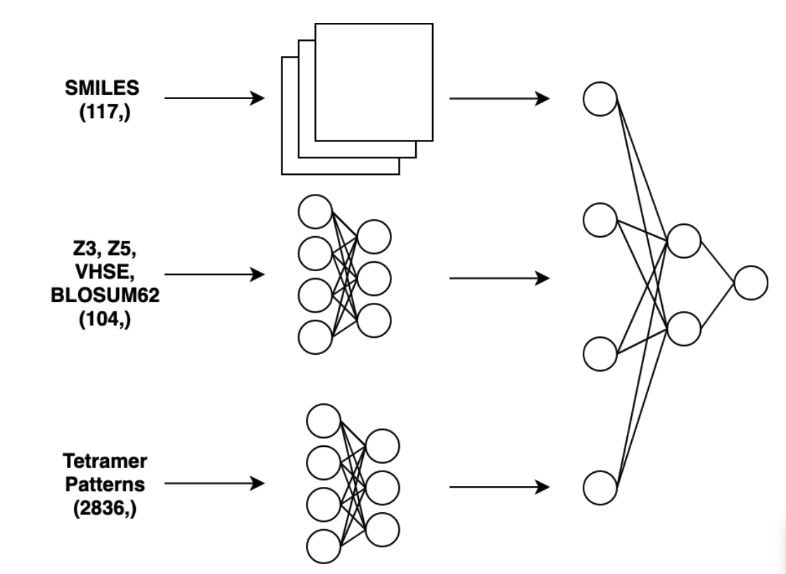

# PROTEIN PROPERTY PREDICTION

ALl work associated to personal project relating to predicting property of tetramer proteins from SMILES and chemical properties

## PROBLEM
We want to predict the structure activity relationship of tetramer polypeptides (proteins with 4 amino acids) given the amino acids and a few descriptors of chemical properties, as seen in the data section. We have a fraction of all possible polypeptide tetramers (64,000) and want to predict the remainder of the dataset (160,000) using a machine learning model. 

## DATASET

### LABELS: STRUCTURE-ACTIVITY-RELATIONSHIP
"The structure–activity relationship (SAR) is the relationship between the chemical structure of a molecule and its biological activity. The analysis of SAR enables the determination of the chemical group responsible for evoking a target biological effect in the organism. This allows modification of the effect or the potency of a bioactive compound (typically a drug) by changing its chemical structure."

### PYHSIOCHEMICAL PROPERTY DATASET
A dictionary for mapping tetrameter patterns to the following descriptors of tetramer properties:
* VHSE (principal components score Vectors of Hydrophobic, Steric, and Electronic properties) 
* BLOSUM62 (analyze the frequencies of amino acid substitutions in clusters of related proteins. Within each cluster, or block, the amino acid sequences were at least 62% identical when two proteins were aligned) 
* Z3 and Z5 scores (physicochemical properties of the AAs including NMR data and thin-layer chromatograph) 
For more information about these features, see [here](https://bmcbioinformatics.biomedcentral.com/articles/10.1186/s12859-020-03546-x)

### SMILES
SMILES (simplified molecular-input line-entry system) "is a specification in the form of a line notation for describing the structure of chemical species using short ASCII strings. SMILES strings can be imported by most molecule editors for conversion back into two-dimensional drawings or three-dimensional models of the molecules". Smiles strings are generated for all 160,000 molecules.

## SOLUTION

### MODEL 

The model used to solve this problem is a hybrid neural network with mixed inputs (from three separate sub-networks) which are fused in a final meta-network. The first sub-network (indicated at the top) is a variation of the Darkchem network, which accepts an integer-encoded SMILES string, uses a matrix embedding to create a feature vector which is passed to a convolutional neural network (of three filters and three kernels) to reconstruct 2-D protein information, which is flattened prior to input to the second network. The second sub-network is a multi-layer perceptron of length=104, which accepts all the float features from Z3, Z5, VHSE and BLOSUM62 feature engineering. The final sub-network accepts the tetramer patterns extracted using the feature engineering technique described in Yan et al (2021). The final network is a multi-layer perceptron with linear activation, which combines the latent representations from each sub-network and produces a regression output. The final hyperparameters (# layers, # nodes, activation functions, % dropout) are optimized using the Keras Tuner API.

